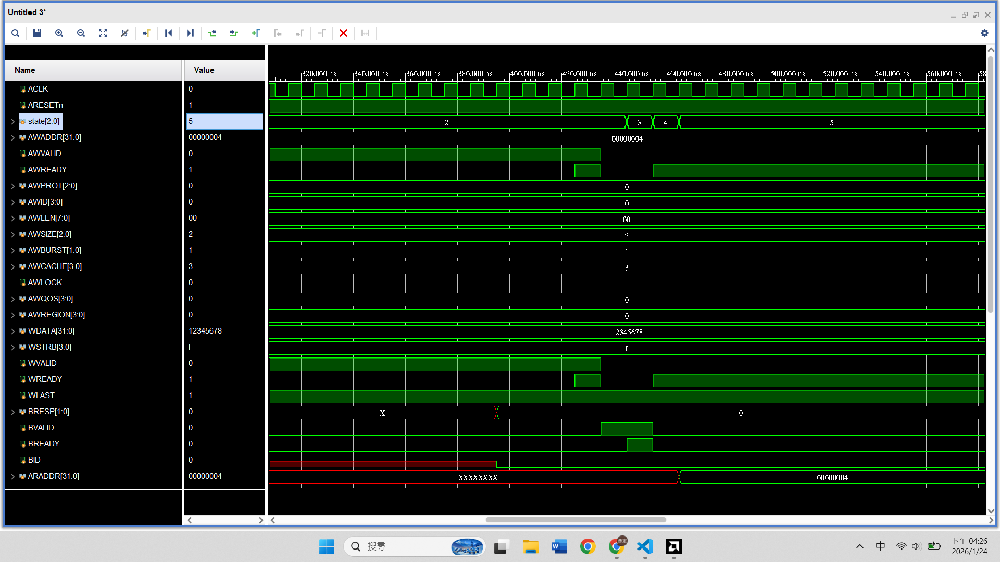
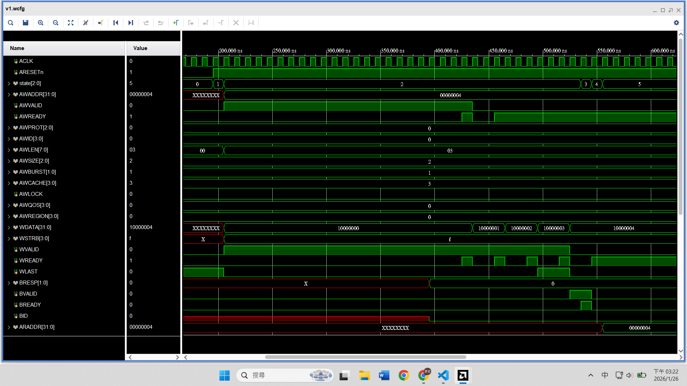
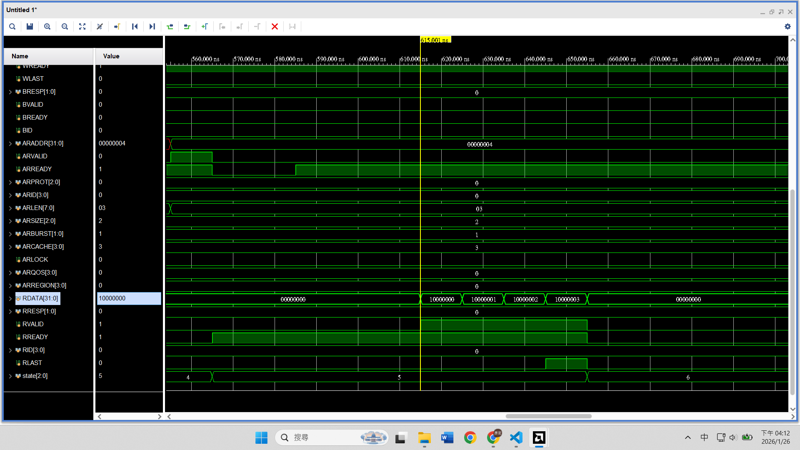

# AXI4 Full
## 前情提要
因為 AXI4 Full protocol spec 蠻複雜的，所以接下來會邊 **建立 AXI4 mental model** 邊 **實作受限版本**，最後再用 spec 補洞。而不是一開始就硬啃 spec  

學習路徑：
1. 知道 AXI4 比 Lite 多了什麼，為什麼要這樣設計
2. 開始 AXI4 Full 受限模式實作
    - 訊號是 AXI Full，行為卻像 AXI-Lite
        ```
        ID = 0
        BURST_LEN = 1
        No outstanding
        ```
    - 加入 burst，但不加 outstanding
    - 加入 outstanding


## AXI4 簡介
### 分 5 個 channel
|Channel|功能
|-|-|
|AW| 寫入 **這筆交易是什麼**|
|W| 寫資料|
|B| 寫入完成的回應|
|AR| 讀取 **這筆交易是什麼**|
|R| 讀出的資料 + 回應|  

  

> **這筆交易是什麼** 的意思 (先看看就好)：  
>AW, AR channel 不只有地址，還有很多欄位要填：  
>1. 地址 `AWADDR`：寫入位址。
>2. 數量 `AWLEN`：一次送 1 個，還是連續送 16 個？
>3. 大小 `AWSIZE`：每個包裹是 32-bit 還是 64-bit 寬？
>4. 堆疊方式 `AWBURST`：地址要自動 +1 ( INCR )，還是固定不動 ( FIXED )？
>5. 優先順序 `AWQOS`：這是急件嗎？
>6. 訂單編號 `AWID`：這是第幾號訂單？（方便亂序回覆）  
>
>所以，**這筆交易是什麼** 的意思是：它會定義這筆傳輸的「格式、長度、類型」。

---
### Valid and Ready
5 個 channel，全都遵守
```clike
if (VALID && READY)
    transfer happens
```
#### Valid
代表 **我現在輸出的這組訊號是穩定且有效的**
#### Ready
代表 **我這拍可以接收**


### ID
#### AXI-Lite 世界觀
- 一次只允許一筆 transaction
- 流程：
    - 送完 address
    - 送完 data
    - 收到 response
    - 才能下一筆 transaction  


slave 完全沒有搞混交易的可能
#### AXI Full 世界觀
例如：
```
Master:
  AW #1 (addr=0x100, ID=3)
  AW #2 (addr=0x200, ID=7)

Slave:
  AWREADY 都收了
  但 #2 比 #1 先完成
```

Slave 回傳：
```
B (ID = 7)
B (ID = 3)
```
假如沒有附上 ID，不知道 response 是給哪筆交易的。  
因為 AXI Full 並不是一筆做完才能做下一筆

### Burst 
#### Burst 是什麼
**一個 address transaction，對應多個 data beat**  
也就像是：
```
AW:
  addr = 0x100
  len  = 7         // total 8 beats
  size = 3'b010    // each data is 4 byte

W:
  beat0
  beat1
  ...
  beat7
```
大多數情況，AXI 都是使用 `INCR (Increment mode) burst`  
Master 只需要在 `AW` 通道講一次地址，Slave 會自動計算後續 data 的位址  
以上述例子來看：  
- Beat 0：寫入 `0x100` (起始點)
- Beat 1：寫入 `0x104` (自動 + 4)
- Beat 2：寫入 `0x108` (自動 + 4)
- ...
- Beat 7：寫入 `0x120` (自動 + 4) ⭢ `WLAST` 拉高，結束

#### 為什麼叫做 "beat"
源自音樂的**節拍**。在這段傳輸中，每次 `VALID` 和 `READY` 握手成功，這動作就叫一個 "beat"

#### 為什麼要 burst
**效率**  
只需要填一次交易內容，剩下時間都在資料傳輸


### Outstanding 是什麼
**address phase 和 data / response phase 完全 pipeline**  
之後用 FIFO + ID table 把它拆開來看


### AXI-Lite vs AXI Full signal
#### 總覽表
| Channel | AXI-Lite           | AXI-Full           |
| ------- | ------------------ | ------------------ |
| AW      | 1 address = 1 data | 1 address = N data |
| W       | 只有 1 beat         | 多個 beat + WLAST  |
| B       | 單一回應             | 同樣，但有 BID     |
| AR      | 同 AW              | 同 AW              |
| R       | 單一 data           | 多 beat + RLAST   |

### Write Address Channel (AW)
AW 目標是 **從這個 address 開始，用某種方式，傳一串 data**    

已經會的 AXI-Lite
```verilog
AWADDR / AWPORT
AWVALID / AWREADY
```  

AXI-Full 多了
```verilog
AWID     // 交易編號
AWLEN    // burst 長度 - 1
AWSIZE   // 每個 beat 幾 bytes
AWBURST  // FIXED / INCR / WRAP
```
##### 注意
- `AWLEN = 0` 代表 1 個 data，`AWLEN = 1` 代表 2 個 data ，以此類推  
- `AWSIZE = log2 (bytes per beat)`

### Write data channel (W)
**每一次 `WVALID` 和 `WREADY` 等於 1 個 beat**    
  
  
已經會的 AXI-Lite
```verilog
WDATA / WSTRB
WVALID / WREADY
```  

AXI-Full 多了
```verilog
WLAST    // 代表這個 burst 的最後一個 beat
```


### Write Response Channel (B)
B 目標是告知 **這整個 burst 寫完了**  

已經會的 AXI-Lite
```verilog
BRESP
BVALID + BREADY
```  

AXI-Full 多了
```verilog
BID
```

### Read Address Channel (AR)
幾乎和 AW 新增的一樣
```verilog
ARID
ARADDR
ARLEN
ARSIZE
ARBURST
ARVALID / ARREADY
```

### Read data channel (R)
已經會的 AXI-Lite
```verilog
RDATA
RVALID / RREADY
```  

AXI-Full 多了
```verilog
RLAST
RID
```
---

## 開始寫 master 囉
### 現在的目標
不是真正支援 AXI-Full 的所有功能，而是：
- **介面 = AXI-Full**  
- **行為 = AXI-Lite (burst = 1, ID fixed, no outstanding)**  


所以我們會：
- 在各個 channel 加入 AXI-Full 訊號 (基於 `AXI_Lite_src/axi_lite_master.v`)
- 新增的訊號值固定

#### Write Address Channel
新增  
```verilog
output reg [3:0] M_AXI_AWID,
output reg [7:0] M_AXI_AWLEN,
output reg [2:0] M_AXI_AWSIZE,
output reg [1:0] M_AXI_AWBURST,
```
固定值  
| 訊號      | 固定值    | 意義             |
| ------- | ------ | -------------- |
| AWID    | 0      | 單一 transaction |
| AWLEN   | 0      | burst = 1      |
| AWSIZE  | 3'b010 | 4 bytes        |
| AWBURST | 2'b01  | INCR           |

#### Write Data Channel
新增
```verilog
output reg M_AXI_WLAST,
```
固定值
```verilog
M_AXI_WLAST = 1;     // 只有 1 beat
```

#### Write Response Channel
新增
```verilog
input wire [3:0] M_AXI_BID
```
固定值
```verilog
M_AXI_BID = 0;
```

#### Read Address Channel
新增
```verilog
output reg [3:0] M_AXI_ARID,
output reg [7:0] M_AXI_ARLEN,
output reg [2:0] M_AXI_ARSIZE,
output reg [1:0] M_AXI_ARBURST,
```
固定值 (同 AW)  
| 訊號      | 固定值    | 意義             |
| ------- | ------ | -------------- |
| ARID    | 0      | 單一 transaction |
| ARLEN   | 0      | burst = 1      |
| ARSIZE  | 3'b010 | 4 bytes        |
| ARBURST | 2'b01  | INCR           |

#### Read Data Channel
新增　
```verilog
input wire [3:0] M_AXI_RID,
input wire        M_AXI_RLAST,
```
固定值
```verilog
M_AXI_RID = 0;
M_AXI_RLAST = 1;
```


#### Sideband Signals
不過因為 AXI4-Full 為了支援各種複雜情況 (ex~ 虛擬化、多核心快取一致性或 QoS)，定義了很多 **旁路訊號 (Sideband Signals)**  
VIP 會嚴格檢查協議完整性，只要 `VALID` 拉起來，這些訊號絕對不能是 `X (未定義)`  


```verilog
output reg  [3:0]  M_AXI_AWCACHE,
output reg         M_AXI_AWLOCK,
output reg  [3:0]  M_AXI_AWQOS,
output reg  [3:0]  M_AXI_AWREGION,
```

```verilog
output reg  [3:0]  M_AXI_ARCACHE,
output reg         M_AXI_ARLOCK,
output reg  [3:0]  M_AXI_ARQOS,
output reg  [3:0]  M_AXI_ARREGION,
```
簡單說明一下
- CACHE
    - Bit 0: Bufferable (可緩衝) 
        - 0 (Non-bufferable): 
            - Master 說：「我要確保這個數據真的寫進了最終的目的地 (Device)，對方親自收到後，才能回傳 Response 給我」
            - 用途：寫入硬體暫存器 (Registers) 時一定要用這個。不然你以為馬達停了，結果指令還卡在半路

        - 1 (Bufferable): 
            - Master 說：「我不介意中間的路由器 (Interconnect) 或寫入緩衝區 (Write Buffer) 先幫我收下，並馬上回傳 Response 給我。至於它什麼時候真正寫進去我不關心」
            - 寫入 DDR 記憶體時為了效能，通常允許中間站先收下。
    - Bit 1: Modifiable (可修改)
        - 0 (Non-modifiable)
            - 這筆交易的地址、突發長度 (Burst Length)、大小都不能被改變。Master 送出什麼，Slave 就必須收到什麼
            - 用途： 絕對是暫存器 (Register) 操作。如果你寫 4 bytes 到控制暫存器，結果路由器幫你拆成 4 個 1 byte，硬體可能會壞掉
        - 1 (Modifiable):
            - 路由器 (Interconnect) 有權利把這筆交易「拆成小筆」或「合併成大筆」
            - 用途： 記憶體存取 (DDR)。
            - 例如：發出一個 64-byte 的寫入，但中間經過一個只有 32-bit 寬的匯流排，路由器會自動幫你拆成 16 筆交易
    - Bit 2 & 3: Allocate (快取分配) ——「要不要放進 L2 Cache？」  
    這兩個 bit 是給系統中的 System Cache (如 L2 Cache) 看的建議。
        - Bit 2 (Read Allocate): 讀取如果沒命中 (Miss)，要不要把資料搬進 Cache？
        - Bit 3 (Write Allocate): 寫入如果沒命中，要不要把資料搬進 Cache？
        - 對於簡單的 Master IP，這兩個 bit 影響不大，通常是 CPU 比較在意。
   - 懶人包
       - 情境 A：控制硬體暫存器 (Device / Register Access)
            - 設定值：`4'b0000`
            - 含義： Non-bufferable, Non-modifiable
            - 翻譯： 這是重要指令！不准緩衝、不准改封包、不准進 Cache，給我直接送到目的地！

        - 情境 B：讀寫 DDR 記憶體 (Normal Memory Access)
            - 設定值：`4'b0011` (最常用) 或 `4'b1111`
            - 含義： Bufferable, Modifiable。
            - 翻譯：這是大量數據。為了效率，中間站可以幫忙代收，也可以幫我拆包重組，隨便你怎麼優化都行
    - 寫入 Slave 的暫存器： 用 `0000`。
    - 傳輸大量資料到 RAM： 用 `0011`。
   
   
   
    
- LOCK
    - 用途：用於 atomic operation，例如「讀取-修改-寫入」的過程中，不讓其他 Master 插隊。
    - AXI4 變化： AXI4 把它簡化成只有 1 bit (0 = Normal, 1 = Exclusive)。以前 AXI3 有 2 bits (還包含 Locked transfer)，但容易造成系統 deadlock，所以被廢除了。
- QOS
    - 用途： 就像機場的 VIP 通道。數值越高，Interconnect (路由器) 會優先處理這筆交易。例如 CPU 的請求通常比 DMA 的請求優先級高。
- REGION
    - 用途：當一個 Slave 介面後面接了多個實體記憶體介面時，用來指名要去哪一個區域。通常設 0 即可。

>以上改動後程式碼在 `AXI_Full_src/master_v1.v` /  `AXI_Full_src/tb.v`  

### 建立專案，用 VIP 驗證一下
和 AXI-Lite 流程大致相同
1. 新建 project
2. IP Catalog 找到 VIP 加進去   
  

4. 加入 `master_v1.v`, `tb_v1.sv`
5. run simulation
6. 看看波型
  

---
### 現在的目標：支援 burst, 但不支援 outstanding
一個 AW → 多個 W → 一個 B
- AXI4 INCR burst

#### 先改 Write
假設要寫 4 beats (32-bit)

1. 決定 burst 參數
    ```verilog
    localparam BURST_LEN = 4;
    ...
    AWLEN = BURST_LEN - 1;  // beat - 1
    AWSIZE = 3'b010;        // 4 bytes (log2(4))
    AWBURST = 2'b01;        // INCR
    ```
2. 加入 write burst 計數器
    ```verilog
    reg [7:0] w_beat_cnt;
    ```
    記得初始化
    ```verilog
    w_beat_cnt <= 0;
    ```

3. 改寫 Write state
    - AW handshake 一次
    - W 會 handshake 多次
    - 最後一拍 `WLAST = 1`
    ```verilog
    WRITE: begin
        // Address channel
        if (M_AXI_AWREADY && M_AXI_AWVALID) begin
            M_AXI_AWVALID <= 0;
        end

        // Write data channel
        if (M_AXI_WREADY && M_AXI_WVALID) begin
            w_beat_cnt <= w_beat_cnt + 1;

            M_AXI_WDATA <= M_AXI_WDATA + 32'h1;

            if (w_beat_cnt == BURST_LEN - 2) begin
                // next cycle is last burst cycle
                M_AXI_WLAST <= 1;
            end
            else if (w_beat_cnt == BURST_LEN - 1) begin
                // finish burst
                M_AXI_WVALID <= 0;
                M_AXI_WLAST  <= 0;
            end
        end

        if (!M_AXI_AWVALID && !M_AXI_WVALID) begin
            M_AXI_BREADY <= 1;
            state <= WAIT_B;
        end
    end
    ```
> 以上 code 會在 `AXI4_Full_src/master_v2.v`
#### 用 VIP 驗證一下
1. 打開上個 project
2. 把 `master_v1.v` 替換成 `master_v2.v`
3. run simulation
4. 看看波型，`WDATA` 是否正確寫入
  

#### 再改 Read
假設一樣讀 4 beats
1. burst 參數
    ```verilog
    M_AXI_ARLEN <= BURST_LEN - 1;
    M_AXI_ARSIZE <= 3'b010;
    M_AXI_ARBURST <= 2'b01;
    ```
2. 加入 read burst counter
    ```verilog
    reg [7:0] r_beat_cnt;
    ```
3. 改寫 WAIT_R State
    - Slave 會連續送 RVALID
    - 最後一拍一定 `RLAST = 1`
    - Master 只要在 burst 期間一直把 `RREADY = 1` 維持住  
    ```verilog
    WAIT_R: begin
        if (M_AXI_RVALID && M_AXI_RREADY) begin
            r_beat_cnt <= r_beat_cnt + 1;

            // check or store M_AXI_RDATA
            // $display("Read beat %0d = %h", r_beat_cnt, M_AXI_RDATA);

            if (M_AXI_RLAST) begin
                // finish burst 
                M_AXI_RREADY <= 0;
                state <= DONE;
            end
        end
    end
    ```
    - 注意我們不用 counter 判斷結束與否，而是用 `RLAST == 1`
> 以上 code 會在 `AXI4_Full_src/master_v3.v`
#### 用 VIP 驗證一下
1. 打開上個 project
2. 把 `master_v2.v` 替換成 `master_v3.v`
3. run simulation
4. 看看波型，`RDATA` 是否正確讀出
  


