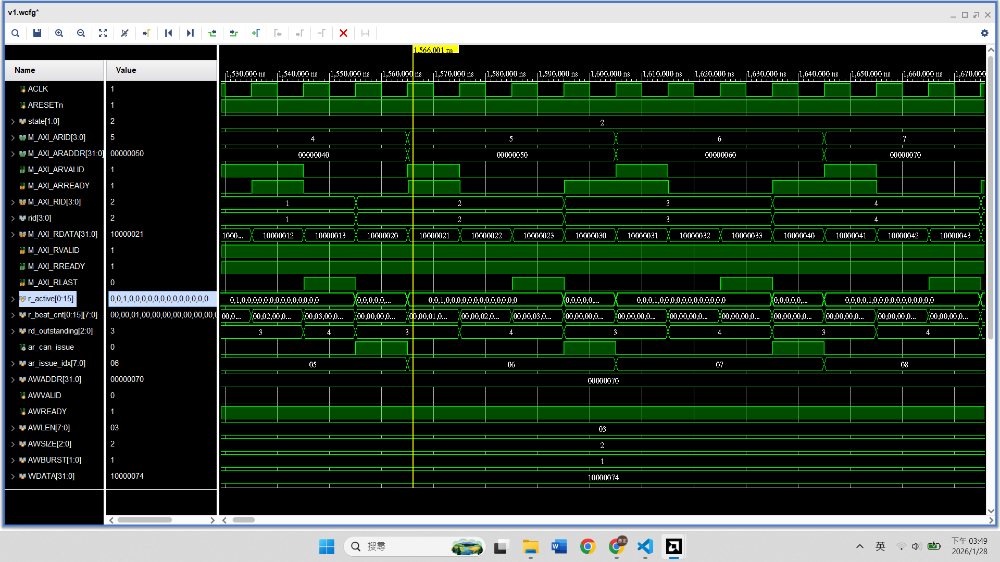

# AXI4 ID
## ID 的功能
- 讓 Master 在 **同時有多個 transaction 還沒完成時**，  
知道每一筆回來的 response/data 是屬於哪一筆 request
- 支援 **亂序完成** 和 **交錯傳輸**


## Outstanding ⭢ ID
現在已經做到：
- 同時送出多個 `AW` (`wr_outstanding > 1`)
- 同時送出多個 `AR` (`rd_outstanding > 1`)

但是 **Slave 有權力用任何順序回覆** (不同交易間)

AXI4 沒有規範
- `B` 一定依照 `AW` 順序回
- `R` burst 一定依照 `AR` 順序回

## ID and it's rule
~~ID = burst number~~  
ID = transaction 的名字 (tag / label)
- 同個 burst 的所有 data beats → **同一個 ID**
- 不同 burst → **ID 可以相同或不同** (由 Master 決定)

#### Rule 1: 同個 ID 的 transaction 必須 in-order
    
- 所以 out-of-order 只發生在 **不同 ID 之間**

#### Rule 2: 不同 ID 的 transaction 可以完全亂序


#### Rule 3: ID 是 Master 的責任

## Write and Read
### Write
AXI4 取消了 `WID`，所以寫入的亂序只發生在 `B` Channel，`W` channel 無法亂序  

ex~
1. Master 發出 `AWID` = 0 (Addr A)
2. Master 發出 `AWID` = 1 (Addr B)
3. Master 依序送出 Data A, Data B (`W` Channel 沒 ID，只能依序)
4. Slave 處理 B 比較快，先回傳 `BID` = 1 (`BVALID`)
5. Master 收到，標記 B 交易完成
6. Slave 處理 A 完畢，回傳 `BID` = 0 (`BVALID`)。

### Read
支援 Read Data Interleaving (讀取資料交錯)  


ex~ 假設 Burst Length = 2 beats
1. Master 發出 `ARID` = 0 (Addr A)
2. Master 發出 `ARID` = 1 (Addr B)
3. Slave 回傳資料流可能長這樣：
    - `RID` = 1, Data = B0 (B 的第一筆先回來!)
    - `RID` = 0, Data = A0 (A 的第一筆)
    - `RID` = 1, Data = B1 (B 結束)
    - `RID` = 0, Data = A1 (A 結束)


### 啟動 !
目標：引入 ID，但還是假設 in-order
- 每個 `AW` / `AR` 都有 ID
- Slave 回 `B` / `R` 時，我們去看 `BID` / `RID`
- 不處理亂序
- 不同 ID 交錯回來時不保證正確

因為 write 似乎比較難，先搞搞 read

#### 回顧 `master_v6`
其實現在每個 burst 都有自己的名字，叫做 `*_burst_idx`，  
但它應該叫 `ID`

#### 最小 per-ID state
對讀取來說，額外要有兩個 array
| state| 意義|
| - | -- |
| beat_cnt [ID] | 這個 burst 回到第幾拍 |
| active [ID]   | 這個 ID 是否正在接收資料 |


不過現在假設一次只有一個 ID 在 active  
因此現在的結構是  
```scss
AR(issue_idx++)
→ rd_outstanding++
→ R channel
   └─ r_burst_idx++
   └─ r_active (只允許一個 burst)
   └─ r_beat_cnt
```
未來 Out-of-order 的結構
```scss
AR(issue_idx++)
→ rd_outstanding++
→ R channel
   └─ per-ID state
        ├─ active[ID]
        ├─ beat_cnt[ID]
        └─ done[ID]
```
- `r_burst_idx` 會被刪掉，因為 `ID` 本身就是 index
- `r_active` ⭢ `r_active[ID]`
- `r_beat_cnt` ⭢ `r_beat_cnt[ID]`

保持不動的 reg
- `ar_issue_idx`：發 request 的順序
- `rd_outstanding`：流量控制

#### 開始改 code
```verilog
localparam ID_W = 4;
localparam ID_NUM = 1 << ID_W;
```
`ID_W`
- ID Width 代表 ID 訊號的位元寬度
- 現在是 4 bits

`ID_NUM`
- ID 的總數量
- Master 需要多少個空格紀錄每個 ID 的進度

```verilog
reg r_active [0 : ID_NUM - 1];
reg [7:0] r_beat_cnt [0 : ID_NUM - 1];
```
把 `active` 和 `beat_cnt` 變成各個 ID 分別紀錄


```verilog
wire [ID_W - 1 : 0] rid = M_AXI_RID;
```
上面兩個 array 的 index

```verilog
integer i;
...
    for (i = 0; i < ID_NUM; i = i + 1) begin
        r_active[i] <= 0;
        r_beat_cnt[i] <= 0;
    end
...
```
初始化矩陣


```verilog
// start R
    if (rd_outstanding > 0) begin
        M_AXI_RREADY <= 1;
    end
    else begin
        M_AXI_RREADY <= 0;
    end
```
直接由 `rd_outstanding` 判斷，而不用之前的 reg `r_active`

```verilog
// receive data
    if (M_AXI_RVALID && M_AXI_RREADY) begin
        // check or store M_AXI_RDATA
        $display("Read ID %0d beat %0d = %h", 
                rid, r_beat_cnt[rid], M_AXI_RDATA);
```
輸出改成用 `rid` 呈現


```verilog
        if (!r_active[rid]) begin
            r_active[rid] <= 1;
            r_beat_cnt[rid] <= 1;
        end 
```
收到某個 ID 的第 1 個 beat  

```verilog
        else begin
            r_beat_cnt[rid] <= r_beat_cnt[rid] + 1;
        end
```
beat 遞增


```verilog
        if (M_AXI_RLAST) begin
            r_active[rid] <= 0;
            r_beat_cnt[rid] <= 0;
        end
    end
```
結束這個 ID 的 burst  

```VERILOG
    if ((ar_issue_idx == TOTAL_BURSTS) && 
        (rd_outstanding == 0) && 
        !M_AXI_ARVALID) begin
        state <= DONE;
    end 
```
刪掉不用的 `r_active`

> 完整 code 位於 `AXI4_ID_src/master_v7.v`

#### VIP 驗證
1. 新建 project
2. 加入 `master_v7.v` `tb_v1.sv`
3. 從 IP Catalog 加入 AXI VIP (設定和之前相同)
4. run sim, run all
5. 看看波型，`RID` `r_active[rid]` `burst_idx[rid]`
    
    