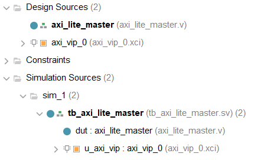
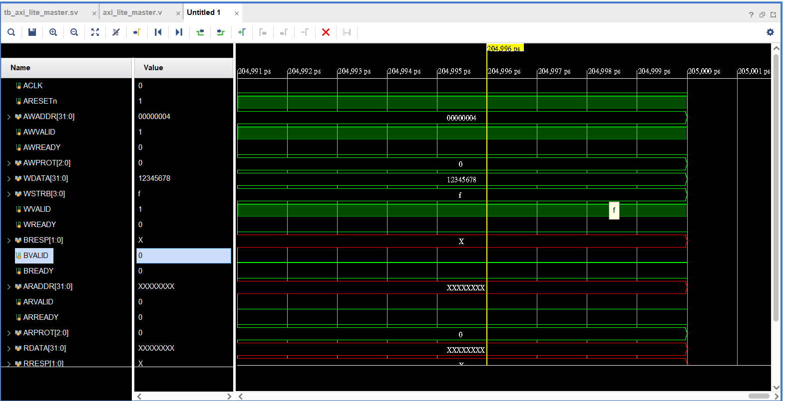
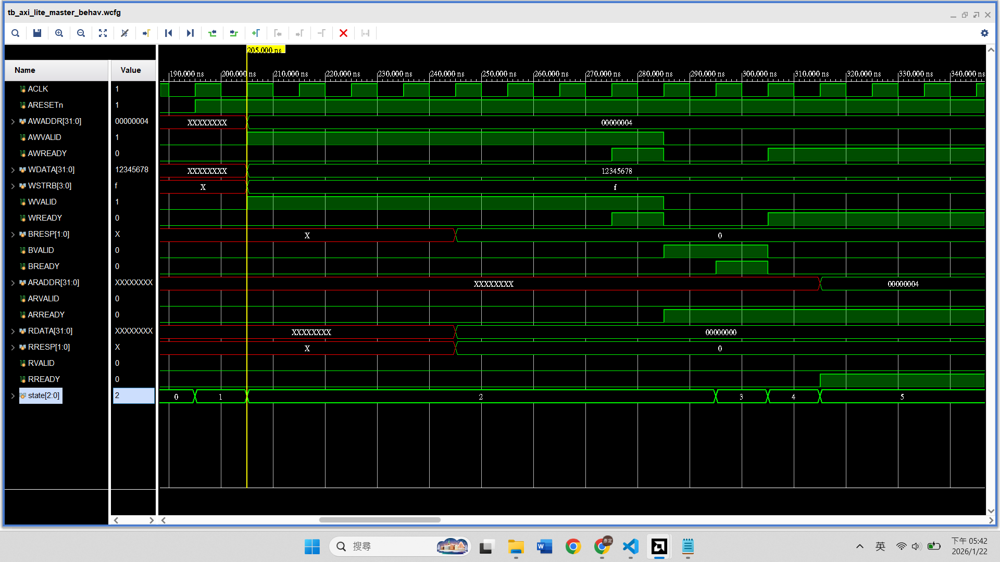

# AXI4-Lite
## 來學 AXI4-Lite 吧 !
AXI4-Lite 相比 AXI4，少了 burst 的功能。因此比 AXI4 interface 簡單一些，但是最基礎的功能不變。  
柿子先挑軟的吃，來了解了解 AXI4-Lite 在做啥。

### Signal
AXI4-Lite interface 有 5 個 channels
- Read Address
- Read Data
- Write Address
- Write Data
- Write Response
#### Global Signals
|name |descrption|
|-|-|
|ACLK|Global clock source|
|ARESETn|Global reset source, active LOW|


#### Write Address Channel
|name|Source|Description|
|-|-|-|
|AWVALID|Master|Write address valid. Master generates this signal when Write Address and control signals are valid|
|AWREADY|Slave|Write address ready. Slave gererates this signal when it can accept Write Address and control signals|
|AWADDR|Master|Write address, usually 32-bit wide
|AWPROT|Master|Protection type. Slave IP usually ignores and Master IP generates transactions with Normal, Secure and Data attributes (000)|


#### Write Data Channel
|name|Source|Description|
|-|-|-|
|WVALID|Master|Write valid. This signal indicates that valid write data and strobes are available.
|WREADY|Slave|Write ready. This signal indicates that the slave can accept the write data|
|WDATA|Master| Write data (32-bit only)|
|WSTRB|Master| Write strobes. 4-bit signal indicating which of the 4-bytes of Write Data. Slaves can choose assume all bytes are valid|


#### Write Response Channel
|name|Source|Description|
|-|-|-|
|BVALID|Slave| Write response valid. Slave generates this signal when the write response on the bus is valid.
|BREADY|Master|Response ready. Master generates this signal when it can accept a write response|
|BRESP|Slave|Write response. This signal indicates the status of the write transaction|


#### Read Address Channel
|name|Source|Description|
|-|-|-|
|ARVALID| Master|Read address valid. Master generates this signal when Read Address and the control signals are valid|
|ARREADY| Slave|Read address ready. Slave generates this signal when it can accept the read address and control signals|
|ARADDR| Master|Read address, usually 32-bit wide|
|ARPROT| Master| Protection type. Xilinx IP usually ignores as a slave. As a master IP generates transactions with Normal, Secure, and Data attributes (000)|


### Read Data Channel
|name|Source|Description|
|-|-|-|
|RVALID|Slave| Read valid. Slave generates this signal when Read Data is valid|
|RREADY |Master| Read ready. Master generates this signal when it can accept the Read Data and response|
|RDATA|Slave| Read data (32-bit only)
|RRESP|Slave| Read response. This signal indicates the status of data transfer|


## 簡單的例子
### AXI4-Lite 世界觀  
|CPU 動作| AXI 動作|  
|-|-|  
|Store|送 address → 送 data → 等 OK|
|Load |送 address → 等 data|

發送端送 `valid` 訊號，接收端送 `ready` 訊號
每個操作都用 `valid / ready` 確認  
**只有在 `valid && ready == 1` 的那個 cycle，事情才真的發生**


### 寫入 (Store)
假設我的 CPU 要做
```clike
*(0x8000) = 0x12345678;
```
AXI4-Lite 寫入被拆成 3 個部分
#### 1. 寫入位址 (Write Address Channel)
我要送：
- `AWADDR = 0x8000`
- `AWVALID = 1`

等對方：
- `AWREADY = 1`

#### 2. 寫入資料 (Write Data Channel)
我要送：
- `WDATA = 0x12345678`
- `WSTRB = 4'b1111 (全部 byte 都寫)`
- `WVALID = 1`

等對方：
- `WREADY = 1`

##### AXI 規定：
- address 和 data 是 **兩條獨立通道**
- 不保證誰先 ready (但 AXI4-Lite Slave 通常會同時 ready)
- 也因此 CPU 可以在同個 cycle 寫地址和寫資料，不須分兩個 cycle，可以同時發生，也可以分先後

#### 3. 寫入回應 (Write Response Channel)
對方會送：
- `BVALID = 1` 
- `BRESP = OKAY` `(2'b00)`

我要回：
- `BREADY = 1`

CPU 在這之前不能繼續下一筆 store

#### Finite state machine of write
```clike
IDLE
 ↓
SEND_AW + SEND_W
 ↓
WAIT_B
 ↓
IDLE
```

### 讀取 (Load)
假設我的 CPU 要做：
```clike
r1 = *(0x8000);
```
AXI4-Lite 讀取只有兩部分
#### 1. 讀取位址 (Read Address Channel)
我要送：
- `ARADDR = 0x8000`
- `ARVAILD = 1`

等對方：
- `ARREADY = 1`

#### 2. 讀取資料 (Read Data Channel)
對方送：
- `RDATA`
- `RVALID = 1`
- `RRESP = OKAY`

我回送：
- `RREADY = 1`

**只有在 `RVALID && RREADY == 1` 的那一拍，我才能 latch 資料**

#### Finite state machine for read
```clike
IDLE
 ↓
SEND_AR
 ↓
WAIT_R
 ↓
IDLE
```


## 簡單的例子
#### 目標：
**自己寫一個 AXI Master，利用 AXI VIP 當 Slave，確認自己寫的 AXI Master 有沒有任何問題**  

1. 到 vivado 開新 project
2. 右邊面板 IP Catalog → 找到 AXI Verification IP
3. 設定 AXI VIP
    - Interface model：Slave
    - Protocol：AXI4-Lite
    - Read_Write Mode：READ WRITE
    - Address Width：32
    - Data Width：32
4. 創建 axi master
    - Sources → Add or Create design sources
    - Create file → file name: axi_lite_master
    - 寫 master：
        - 只做 1 次
            1. write `0x12345678` → `0x0000_0004`
            2. read `0x0000_0004`
    - `AXI4_Lite_src/axi_lite_master_v1.v`
5. 創建 tb
    - Source → Add or create simulation sources
    - 把我們寫的 AXI Master 和 AXI VIP 訊號線連接起來
    - module name 根據自己建立的 .v file 和 VIP name 做更改
    - `AXI4_Lite_src/tb_axi_lite_master_v1.sv`  


    
---
6. Simulation
    - 假如 master 沒寫錯，那麼 VIP 就不會在模擬時報錯。我們也能看看波形圖，確認正確寫入與讀取 data
    - 假如沒辦法進入模擬，可能是 tb 沒被正確設為 SystemVerilog file
        1. Simulation sources → 右鍵 tb_axi_lite_master
        2. Set File Type → SystemVerilog 
        3. 或者當初建立 file 時要選擇 SystemVerilog


### 好玩的來了
> 本來想說自己故意弄幾個錯誤的地方，讓 AXI VIP 幫我糾錯。結果無心插柳剛好寫錯了幾個地方，接著讓我們一起看看

#### 1. reset 後 時序問題

如果照著 `v1` 的打，應該會發現模擬後看波型，只有 master 送出 address 和 data 的訊號，AXI VIP 完全沒反應。  





這時我們可以看看 console （題外話，console 好難看 x
```
Fatal: AXI4_ERRM_AWVALID_RESET
The earliest point after reset that a master is permitted to begin
driving AWVALID HIGH is at a rising ACLK edge after ARESETn is HIGH.
```
 

目前 reset 後操作是長這樣  
|Cycle|	ARESETn	|行為|
|-|-|-|
|N	|0	|reset 中|
|N+1|	1|	進入 else，同一個 edge 就拉高 AWVALID|

##### 但 AXI 規範規定的是：  
reset deassert 之後，要等至少 **下一個 clock edge** ，才能開始 drive VALID

因此我們在 master 多增加一個 state，變成以下這樣
```verilog
...
    parameter 
    RESET_WAIT = 0,
    IDLE = 1,
    WRITE = 2,
    WAIT_B = 3,
    READ = 4,
    WAIT_R = 5,
    DONE = 6;

reg [2:0] state;

always @(posedge ACLK) begin
    if (!ARESETn) begin
        state <= RESET_WAIT;

        M_AXI_AWVALID <= 0;
        M_AXI_WVALID  <= 0;
        M_AXI_BREADY  <= 0;
        M_AXI_ARVALID <= 0;
        M_AXI_RREADY  <= 0;
        M_AXI_AWPROT <= 3'b000;
        M_AXI_ARPROT <= 3'b000;
    end else begin
        case (state)

        RESET_WAIT: begin
            state <= IDLE;
        end
        IDLE: begin
...
```
#### 2. 缺少訊號
更改 reset 後時序問題，再模擬一次後，會發現 AXI VIP 還是沒有反應  
看看 console
```
Fatal: AXI4_ERRM_AWPROT_X
When AWVALID is high, a value of X on AWPROT is not permitted.
WARNING: port 's_axi_awprot' is not connected
```
原來是 `AWPROT` 和 `ARPROT` 忘了寫，於是加上以下這些
- master
    ```verilog 
    ...
    // Write Address Protection
    output reg [2:0] M_AXI_AWPROT,

    // Read Address Protection
    output reg [2:0] M_AXI_ARPROT,
    ...
    ...
    if (!ARESETn) begin
        ...
        M_AXI_AWPROT <= 3'b000;
        M_AXI_ARPROT <= 3'b000;
    end
    ...
    ```
- tb
    ```SystemVerilog
    ...
    logic [2:0] AWPROT;
    logic [2:0] ARPROT;
    ...
    .M_AXI_AWPROT (AWPROT),
    .M_AXI_ARPROT (ARPROT),
    ...
    .s_axi_awprot (AWPROT),
    .s_axi_arprot (ARPROT),
    ...
    ```
簡單說明一下 `PROT`
- 用途： 告訴系統這筆資料的「身分地位」。
- bit [0]：Privileged ( `== 1 ? 特權模式 : 用戶模式` )
- bit [1]：Secure ( `== 1 ? 非安全世界 : 安全世界` - TrustZone 概念)
- bit [2]：Instruction ( `== 1 ? 程式碼 : 數據` )


最後我們就可以看到正確的時序啦  




## reference  
1. [Introduction to AXI4-Lite](https://www.realdigital.org/doc/a9fee931f7a172423e1ba73f66ca4081)  
2. [axi_and_ace_protocol_spec 載點](https://documentation-service.arm.com/static/5f915b62f86e16515cdc3b1c)  
    - p29 signal descriptions  
    - p126 AXI-Lite

3. [基于Xilinx VIP的AXI Lite Slave/Master端完整验证实战](https://blog.csdn.net/weixin_42509720/article/details/154766926?spm=1001.2101.3001.6650.3&utm_medium=distribute.pc_relevant.none-task-blog-2%7Edefault%7Ebaidujs_baidulandingword%7ECtr-3-154766926-blog-127293688.235%5Ev43%5Epc_blog_bottom_relevance_base1&depth_1-utm_source=distribute.pc_relevant.none-task-blog-2%7Edefault%7Ebaidujs_baidulandingword%7ECtr-3-154766926-blog-127293688.235%5Ev43%5Epc_blog_bottom_relevance_base1&utm_relevant_index=5)