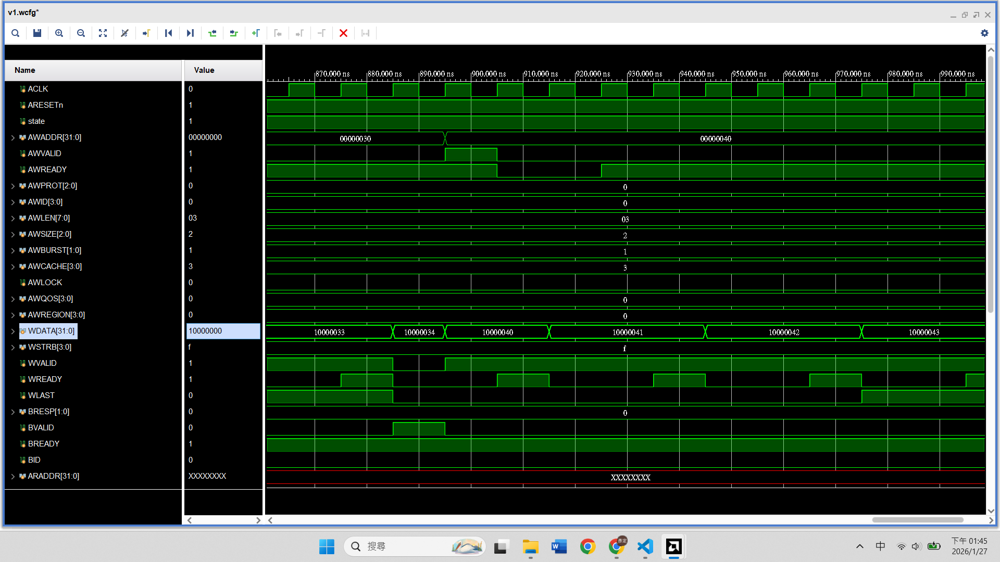
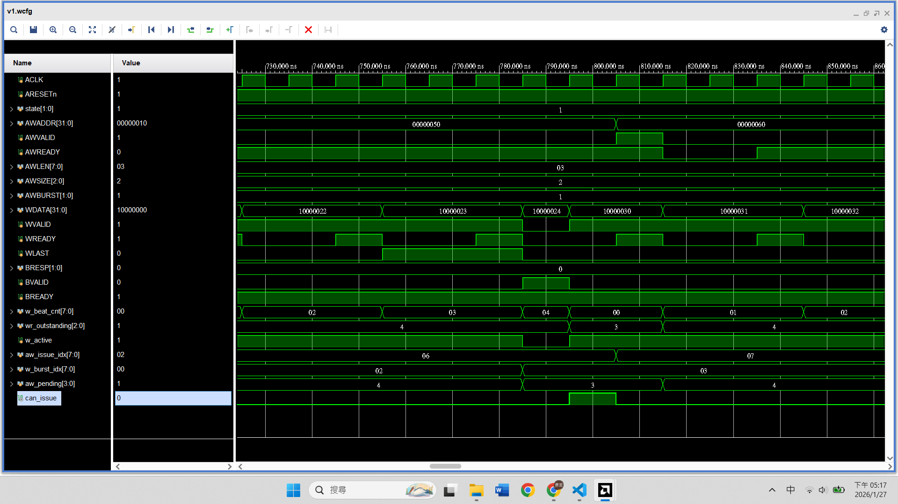

# AXI4 Outstanding
## Outstanding 是什麼
**Master 發出了地址請求，但還沒收到回覆的交易數量**
### Blocking mode (Non-outstanding)
    Master 得等待上一筆做完，才能發下一筆請求
1. Master：我要讀 Addr A
2. Slave：... 這是 Data A
3. Master：我要讀 Addr B
4. Slave：... 這是 Data B
5. Master：我要讀 Addr C
6. Slave：... 這是 Data C   

在 Slave 存取記憶體延遲時，匯流排是閒置的

### Outstanding (Pipelining mode)
    Master 不管 Slave 好了沒，拼命丟地址出去  
1. Master：我要讀 Addr A
2. Master：我要讀 Addr B
3. Master：我要讀 Addr C
4. Slave：... (思考中，同時處理 A, B, C) ...
5. Slave：這是 Data A
6. Slave：這是 Data B ...  

匯流排上隨時都有資料在跑，Slave 內部管線也被塞滿


## 現在的目標：支援 outstanding，但不真正用 ID
- ID 是為了解決 outstanding 之後才出現的問題
- outstanding 不是亂序，而是 **還沒等回應，就先送下一筆請求**  

目前為止的設計是
```text
Write → 等 B → Read → 等 R → Done
```
我們要改成
```text
AW #0 → AW #1 → AW #2
           ↓
      B #0 → B #1 → B #2
```
但一開始我們讓順序依舊是 in-order，所以 ID 固定是 0


### 先只做 write outstanding
`Write outstanding = AW / W 可以連續送多筆，但是 B 之後慢慢回來`
- 不能再送完一筆 → 等 response
- 要變成送好幾筆 → 再收 response


#### FSM 
```verilog
parameter RESET_WAIT = 0, RUN = 1, DONE = 2;
```
變成只有 3 個 state
- `RESET_WAIT` 一樣是 `ARESETn` 被拉高後延遲一個 cycle
- `RUN` 是 write burst, outstanding 的 state
- `DONE` 是寫入完成，trap state

#### 新增變數
一樣有 burst reg 
```verilog
localparam BURST_LEN = 4;       // beats
reg [7:0] w_beat_cnt;           // beat count of current burst
```
再來是 outstanding reg
```verilog
// outstanding
localparam TOTAL_BURSTS = 8;            // 總共有幾次 burst
localparam MAX_WR_OUTSTANDING = 2;      // 最多幾個 outstanding
reg [2:0] wr_outstanding;               // 還沒 response 的 outstanding 數量
reg [7:0] bursts_left;                  // 剩下幾個 burst 要傳
reg sending_w;                          // 現在是否在傳送 w data
```
最後是判斷可不可以發送下個 AW (一開始我們先不把 AW, W 分離)
```verilog
wire can_issue;
assign can_issue = 
    (bursts_left > 0) && 
    (wr_outstanding < MAX_WR_OUTSTANDING) && 
    !M_AXI_AWVALID && 
    !sending_w;
```

#### 兩個 always block
- 主 block
    ```verilog
    always @(posedge ACLK) begin
        if (!ARESETn) begin
            state <= RESET_WAIT;
            ...
            // B
            M_AXI_BREADY  <= 1;         // always ready !!!

            // outstanding
            bursts_left <= TOTAL_BURSTS;
            sending_w <= 0;
            ...
    ```
    - 因為隨時都可以接收回覆，所以 `BREADY` 一直拉高為 1
    - 初始化 `bursts_left` 和 `sending_w`

    ```verilog
        end else begin
            case (state)
                RESET_WAIT: begin
                    state <= RUN;
                end
    ```
    - 與先前相同，只是換成 `RUN` state
    ```verilog
        RUN: begin
            // Issue new AW
            if (can_issue) begin
                M_AXI_AWADDR  <= 32'h0000_0000 + (TOTAL_BURSTS - bursts_left) * 16;
                M_AXI_AWLEN   <= BURST_LEN - 1;
                M_AXI_AWSIZE  <= 3'b010;
                M_AXI_AWBURST <= 2'b01;
                M_AXI_AWVALID <= 1;

                // start W burst
                sending_w <= 1;
                w_beat_cnt <= 0;

                M_AXI_WDATA <= 32'h1000_0000 + (TOTAL_BURSTS - bursts_left) * 16;
                M_AXI_WSTRB <= 4'b1111;
                M_AXI_WVALID<= 1;
                M_AXI_WLAST <= 0;

                bursts_left <= bursts_left - 1;
            end 
    ```
    - If
        - 還有 burst 要傳 `bursts_left > 0`
        - 現在還沒回覆的小於最大需要回覆的數量 `wr_outstanding < MAX_WR_OUTSTANDING`
        - 不在等待 handshake 階段 `!M_AXI_AWVALID`
        - 不在傳送 data 階段 (之後會改掉) `!sending_w`
    - then 發出 AW 請求，`bursts_left` - 1

    ```verilog
        // AW handshake
        if (M_AXI_AWVALID && M_AXI_AWREADY) begin
            M_AXI_AWVALID <= 0;
        end

        // W channel
        if (sending_w && M_AXI_WVALID && M_AXI_WREADY) begin
            w_beat_cnt <= w_beat_cnt + 1;
            M_AXI_WDATA <= M_AXI_WDATA + 1;

            if (w_beat_cnt == BURST_LEN - 2) begin
                M_AXI_WLAST <= 1;
            end
            else if (w_beat_cnt == BURST_LEN - 1) begin
                M_AXI_WVALID <= 0;
                M_AXI_WLAST  <= 0;
                sending_w    <= 0;
            end
        end

    ```
    - If 傳送完這個 burst 了 `w_beat_cnt == BURST_LEN - 1`
    - then 拉低 `WVALID` `WLAST`，以及 `sending_w`
    ```verilog
            if ((bursts_left == 0) && (wr_outstanding == 0) && !sending_w && !M_AXI_AWVALID) begin
                state <= DONE;
            end 
        end
        DONE: begin
            state <= DONE;
        end
    endcase
    ```
    - If 
        - 傳送完所有 burst `bursts_left == 0`
        - 所有請求都被回覆了 `wr_outstanding == 0`
        - 不在等待 handshake 階段 `!M_AXI_AWVALID`
        - 不在傳送 data 階段 (之後會改掉) `!sending_w`
    - then 跳到 `DONE` state


- 副 block
    - 獨立的 B Channel
    - 管理 `wr_outstanding`：多少尚未回覆的 outstanding 數
    ```verilog
    // Independent B channel
    always @(posedge ACLK) begin
        if (!ARESETn) begin
            wr_outstanding <= 0;
        end else begin
            case ({M_AXI_AWVALID && M_AXI_AWREADY,
                   M_AXI_BVALID  && M_AXI_BREADY})
                2'b10: wr_outstanding <= wr_outstanding + 1;
                2'b01: wr_outstanding <= wr_outstanding - 1;
                2'b11: wr_outstanding <= wr_outstanding; // same cycle issue + complete
                default: wr_outstanding <= wr_outstanding;
            endcase
        end
    end
    ```
    - 因為一個 reg 只能被一個 sequential always block 驅動，所以本來在主 block `(M_AXI_AWVALID && M_AXI_AWREADY)` 時，`wr_outstanding <= wr_outstanding + 1` 要拿來一起判斷
> 以上 code 在 `AXI4_Outstanding_src/master_v4.v`

#### VIP 驗證環節
1. 新建 project
2. 加入 `master_v4.v` `tb.sv`
3. 從 IP Catalog 加入 AXI VIP，設置和 AXI Full 相同
4. run simulation
5. 看看波型
    
---
#### 把 AW, W 分離
`can_issue` 判斷條件有一個 `!sending_w`
- 代表目前 AW 等這次一整個 burst 送完後，才會發出下次 AW 
- 但只要 outstanding 還沒滿，AW 應該要可以一直送

AXI4 規定
- `AW` 可以 outstanding 多筆
- `W` 可以跟 `AW` 不同步
- 但 `WDATA` 順序必須符合 `AW` 順序
    ```text
    AW0 → AW1 → AW2
    ------------------
    W0 beat0, beat1, beat2, beat3
    W1 beat0, beat1, beat2, beat3
    W2 beat0, beat1, beat2, beat3
    ```


#### 新增 reg
判斷 `W` 是否正在送某個 burst
```verilog!
reg w_active;
```
將原本的 `bursts_left` 刪掉，換成遞增紀錄
```verilog!
reg [7:0] aw_issue_idx;
```
因為 `AW` 和 `W` 分離了，所以需要額外的 reg 紀錄現在傳送到哪個 burst (之前是用通用的 `bursts_left` 紀錄)
```verilog!
reg [7:0] w_burst_idx;
```
紀錄已經送 `AW`，但 `W` 還沒送的 burst 數量
```verilog!
reg [2:0] aw_pending;
```
更新規則
- `AW` handshake：`aw_pending++`
- `W` burst 完成：`aw_pending--`


Reset 時初始化
```verilog!
// outstanding
w_active <= 0;
aw_issue_idx <= 0;
w_burst_idx <= 0;
aw_pending <= 0;
```

#### 更改 `can_issue`
```verilog!
can_issue_aw = (aw_issue_idx < TOTAL_BURSTS) &&
               (wr_outstanding < MAX_WR_OUTSTANDING) &&
               !M_AXI_AWVALID;
```
不再有 `sending_w`

#### 更改 AW, W 
```verilog!
RUN: begin
    // Issue new AW
    if (can_issue) begin
        M_AXI_AWADDR  <= 32'h0000_0000 + (aw_issue_idx * 16);
        M_AXI_AWLEN   <= BURST_LEN - 1;
        M_AXI_AWSIZE  <= 3'b010;
        M_AXI_AWBURST <= 2'b01;
        M_AXI_AWVALID <= 1;

        aw_issue_idx <= aw_issue_idx + 1;
    end 

    // AW handshake
    if (M_AXI_AWVALID && M_AXI_AWREADY) begin
        M_AXI_AWVALID <= 0;
        aw_pending <= aw_pending + 1;
    end
```
- `AW` 不用管 `W` 的 data, valid 之類的  


```verilog!
// W channel
    // start to send next burst
    if (!w_active && aw_pending > 0) begin
        M_AXI_WDATA <= 32'h1000_0000 + (w_burst_idx * 16);
        M_AXI_WSTRB <= 4'b1111;
        M_AXI_WVALID<= 1;
        M_AXI_WLAST <= 0;

        w_active <= 1;
        w_beat_cnt <= 0;
    end

    if (w_active && M_AXI_WVALID && M_AXI_WREADY) begin
        w_beat_cnt <= w_beat_cnt + 1;
        M_AXI_WDATA <= M_AXI_WDATA + 1;

        if (w_beat_cnt == BURST_LEN - 2) begin
            M_AXI_WLAST <= 1;
        end

        if (w_beat_cnt == BURST_LEN - 1) begin
            M_AXI_WVALID <= 0;
            M_AXI_WLAST <= 0;

            w_active <= 0;
            w_burst_idx <= w_burst_idx + 1;
            aw_pending <= aw_pending - 1;
        end
    end
```
分成兩種情況
- 還沒開始傳 data 並且 `AW` 已經傳 addr 了
    - 開啟這一次的 burst 傳送
- 正在傳 data 時收到 `READY`
    - 繼續傳送下一 beat 的 data
    - 如果傳完了，就更新 `w_active` `w_burst_idx` `aw_pending`

```verilog!
if ((aw_issue_idx == TOTAL_BURSTS) && 
    (wr_outstanding == 0) && 
    !w_active && !M_AXI_AWVALID) begin
    state <= DONE;
end 
```
- 更改原本的判斷條件 `bursts_left == 0` 

> 以上 code 位於 `AXI4_Outstanding_src/master_v5.v`


#### 小總結
目前有 3 條分離的時間軸
```text!
AW issue order:  aw_issue_idx → 0,1,2,3,4...
W send order:   w_burst_idx  → 0,1,2,3,4...
B response:     wr_outstanding control
```

#### VIP 驗證
1. 打開 project
2. 把 `master_v4.v` 換成 `master_v5.v`
3. run simulation
    - 模擬時間可能會不夠(1000 ns)，可以直接按上方橫列出現的 run all 符號，或者按 run for，設定個 500 ns
4. 看看波型，`AW` 有沒有真的和 `W` 分離
    

